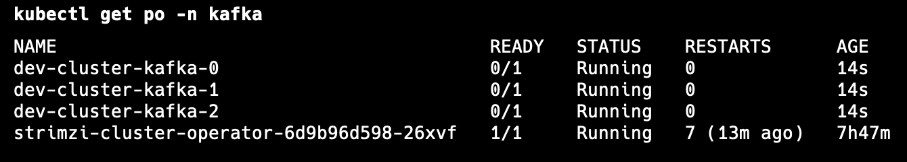

# Introduction

Deploying a Kafka Cluster in Kubernetes using the Strimzi Kafka operator and Kraft, with KIND as the Kubernetes cluster. We use the Nginx Ingress Controller with a Loadbalancer service type to route Kafka components like Kafka brokers, Kafka bridge, Kafka Connect, etc. It's important to enable SSL in the Nginx configuration to secure the communication.

Ref:
- [Strimzi overview](https://strimzi.io/docs/operators/latest/overview)
- [Kafka Examples](https://github.com/strimzi/strimzi-kafka-operator/tree/0.41.0/examples)

## Kafka Cluster Components and Versions

Below is a detailed list of all the components and their respective image versions used in our Kafka cluster setup:

| Component                | Image Version                                                                |
| ------------------------ | ---------------------------------------------------------------------------- |
| Nginx Ingress Controller | registry.k8s.io/ingress-nginx/controller:v1.3.0                              |
| Strimzi                  | quay.io/strimzi/operator:0.39.0                                              |
| Kafka                    | quay.io/strimzi/kafka:0.39.0-kafka-3.6.1                                     |
| Kafka Bridge             | quay.io/strimzi/kafka-bridge:0.27.0                                          |
| Kafka Connect            | Custom image with kafka 3.6.1                                                |
| Kafka Mirror Maker 2     | quay.io/strimzi/kafka:0.39.0-kafka-3.6.1                                     |
| Kafka Exporter           | quay.io/strimzi/kafka:0.39.0-kafka-3.6.1                                     |
| Schema Registry          | confluentinc/cp-schema-registry:6.2.0                                        |
| KSQL DB                  | confluentinc/cp-ksqldb-server:6.1.0                                          |
| Cruise Control           | quay.io/strimzi/kafka:0.39.0-kafka-3.6.1                                     |
| Entity Operators         | quay.io/strimzi/operator:0.39.0                                              |
| OTEL operator            | ghcr.io/open-telemetry/opentelemetry-operator/opentelemetry-operator:v0.88.0 |
| OPA                      | openpolicyagent/opa:latest                                                   |
| OTEL collector sidecar   | otel/opentelemetry-collector-contrib:0.88.0                                  |

# Strimzi Operator and Entity Operators

Strimzi operators create, configure, and manage Kafka components within a Kubernetes environment. Using operators reduces the need for manual intervention and streamlines the process of managing Kafka in a Kubernetes cluster.

## Deployment with Helm

Deploy the Strimzi Cluster Operator using Helm:

```shell
helm install strimzi-cluster-operator oci://quay.io/strimzi-helm/strimzi-kafka-operator -n kafka -f values.yaml --create-namespace
```

**IMPORTANT:** To upgrade the Strimzi operator, use the `helm upgrade` command. This command does not upgrade the Custom Resource Definitions. Install the new CRDs manually after upgrading the Cluster Operator. You can access the CRDs from our [GitHub release page](https://github.com/strimzi/strimzi-kafka-operator/tree/main/helm-charts/helm3/strimzi-kafka-operator#upgrading-your-clusters) or find them in the `crd` subdirectory inside the Helm Chart.

```shell
helm upgrade strimzi-cluster-operator oci://quay.io/strimzi-helm/strimzi-kafka-operator -n kafka -f values.yaml
kubectl apply -f helm3/crds -n kafka
```

Using the Strimzi operator we can deploy the following ‘kind’ of resources:

- Kafka cluster of broker nodes
- Kafka Connect cluster for external data connections
- Kafka MirrorMaker cluster to mirror the Kafka cluster in a secondary cluster
- Kafka Exporter to extract additional Kafka metrics data for monitoring
- Kafka Bridge to make HTTP-based requests to the Kafka cluster
- Cruise Control to rebalance topic partitions across broker nodes

## Kafka Kubernetes deployment — Brokers with KRaft

### Deploying Kafka cluster

After deploying the Strimzi operator, we can deploy the Kafka cluster. We are deploying a Kafka cluster with 3 broker nodes with node pools enabled in Kraft mode along with the entity operators, cruise control, and Kafka exporter.

#### Nodepools

Node pools provide configuration for a set of Kafka nodes. By using node pools, nodes can have different configurations within the same Kafka cluster. For each Kafka node in the node pool, any configuration not defined in the node pool is inherited from the cluster configuration in the Kafka resource. The deployment uses a YAML file to provide the specification to create a KafkaNodePool resource.

**NB:** To deploy a Kafka cluster in KRaft mode, you must use the KafkaNodePool resources.

```yaml
apiVersion: kafka.strimzi.io/v1beta2
kind: KafkaNodePool
metadata:
  name: kafka
  labels:
    strimzi.io/cluster: dev-cluster
spec:
  replicas: 3
  roles:
    - broker
    - controller
  storage:
    type: jbod
    volumes:
      - id: 0
        type: persistent-claim
        size: 10Gi
        deleteClaim: false
```

```bash
$ kubectl apply -f kafka-node-pool.yaml -n kafka
```

To enable node pool and kraft we need to provide the below configuration to the Kafka resource.

```yaml
kind: Kafka
metadata:
  name: dev-cluster
  annotations:
    strimzi.io/node-pools: enabled
    strimzi.io/kraft: enabled
spec:
  kafka:
    version: 3.6.1
    metadataVersion: 3.6-IV2
```

#### KRAFT

KRaft stands for Kafka Raft Metadata mode, which means that Kafka uses the Raft consensus protocol to manage its metadata instead of relying on ZooKeeper. KRaft mode is more scalable than ZooKeeper mode, allowing Kafka clusters to handle more traffic and data. KRaft mode is faster than ZooKeeper mode, resulting in lower latency and higher throughput.

In the KRaft mode, the Kafka cluster will consist only of Kafka nodes. But they have different roles — either controllers, or brokers, or a combination of both.

We can apply the below config for deploying a basic cluster:

```bash
$ kubectl apply -f kafka-cluster.yaml -n kafka
```



```bash
$ kubectl get svc -n kafka

NAME                                   TYPE           CLUSTER-IP      EXTERNAL-IP      PORT(S)                                        AGE
dev-cluster-kafka-0                    LoadBalancer   10.96.55.144    172.20.255.241   9094:30967/TCP                                 3h8m
dev-cluster-kafka-1                    LoadBalancer   10.96.245.178   172.20.255.242   9094:30534/TCP                                 3h8m
dev-cluster-kafka-2                    LoadBalancer   10.96.194.141   172.20.255.243   9094:31620/TCP                                 3h8m
dev-cluster-kafka-bootstrap            ClusterIP      10.96.93.223    <none>           9091/TCP,9092/TCP,9093/TCP                     3h8m
dev-cluster-kafka-brokers              ClusterIP      None            <none>           9090/TCP,9091/TCP,8443/TCP,9092/TCP,9093/TCP   3h8m
dev-cluster-kafka-external-bootstrap   LoadBalancer   10.96.60.188    172.20.255.240   9094:31951/TCP                                 3h8m
```
we will use the `EXTERNAL-IP` of `dev-cluster-kafka-external-bootstrap` for any external use.

# Kafka CRD components

Testing Kafka is working:

running a producer.
```bash
$ kubectl apply -f kafka-producer.yaml
```

check the log on the pod for the consumer.

```bash
$ kubectl apply -f kafka-consumer.yaml
```
