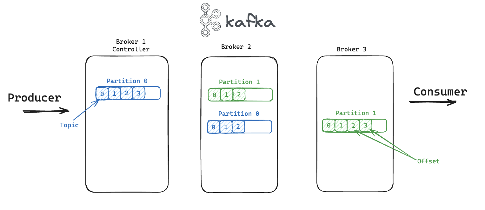

# Kafka-Guide

A comprehensive guide to understanding Apache Kafka, including its architecture, installation steps, and a practical use case demonstration.

Kafka is a message broker using a commit log, often associated with infrastructure data, microservices, and event-driven architectures.

## Architecture

Schema: 

### Kafka Cluster Components

- **Broker**: Acts as a node with SSD storage.
- **Partition**: Ensures high availability and fault tolerance of data. We could have multiple partitions replicated across brokers (Leader and Followers).
- **Topic**: Similar to a table in a database, it defines a data stream.
- **Offset**: The unique identifier for a message/event within a topic.
- **Producer**: Publishes messages to Kafka.
- **Consumer**: Reads messages from a topic.
- **Consumer Group**: Multiple instances of the same application (e.g., App C with 3 instances) can consume messages from specific partitions with coordination.

### Key Features

- **Replications**: Ensures data redundancy and availability.
- **Partitions**: Allows for data distribution and parallel processing.
- **Scalability**: Easily scalable to handle large volumes of data.
- **Performance**: Optimized for high-throughput and low-latency message processing.

Kafka operates asynchronously, and consumers can reread messages since events are stored with offsets.

### Partitioning

Partitions logically divide topics and are distributed across the cluster. Each message within a partition is associated with a unique key.

### Alternatives to Kafka

- RabbitMQ
- ActiveMQ
- ZeroMQ

## Installing Kafka with Kubernetes

Instructions for installing Kafka using Kubernetes will be provided in this section.

## Real-World Example

Tracking a bus to see its real-time position using Flask, JavaScript, and leafletjs .

<video width="320" height="240" controls>
  <source src="images/busTrackerLille.mp4" type="video/mp4">
</video>
